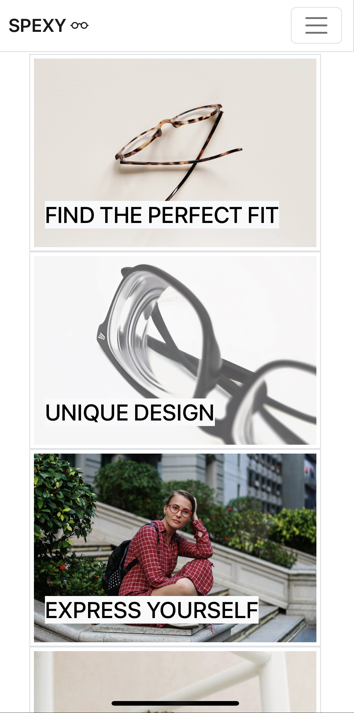
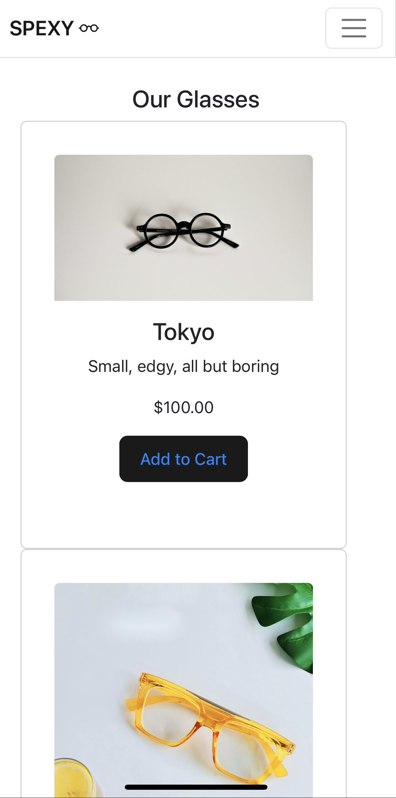
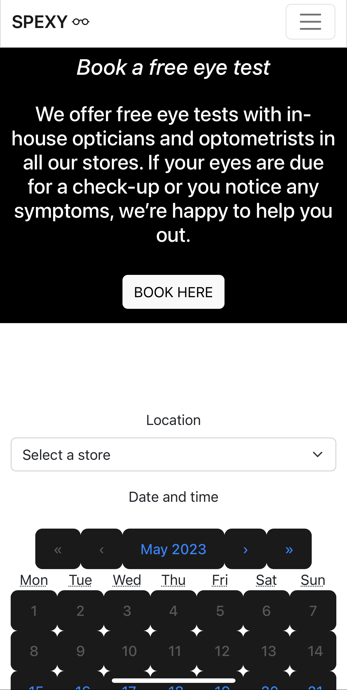
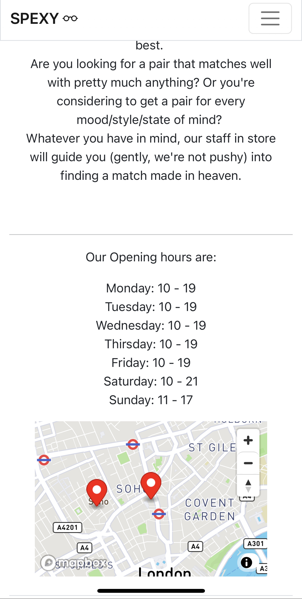
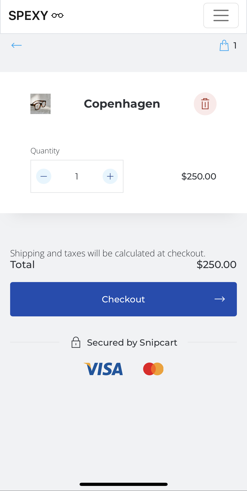

# SPEXY

## Description

SPEXY is the web page of a made-up optical store showcasing the products and services offered.

The web page consists of a Home and 4 other sections:

- Glasses and Sunglasses with a shopping cart to purchase products
- Eye Tests (where customers can book an appointment for an eye test)
- Our Stores (to locate physical stores)

The user can navigate between the different parts of the web app via the navbar at the top or via the burger menu on smaller screens.

The Glasses and Sunglaases sections have cards with CTA buttons redirecting to the 'Shop' section of the page where they can purchase products. The shooping cart is accessible from any part of the application via the top menu bar.

The Eye Tests page has a form where customers can pick a location, time and date for their appointment.

The Our Stores section contains information regarding opening hours and the location of the physical stores within a map.

The page is available at https://spexy.vercel.app/

## Tools Used
- HTML CCS JavaScript
- React JSX to build components
- Bootstrap for the layout
- [Mapbox](https://www.mapbox.com/) for the stores map
- [Snipcart](https://snipcart.com/) for the shopping functionality
- [react-calendar package](https://www.npmjs.com/package/react-calendar) for the date picker
- [react-awesome-reveal](https://www.npmjs.com/package/react-awesome-reveal) for the tiles fade effect

## Demo

## License

This project is licensed under the GNU license.

## How to Contribute

Forks or pull requests are welcomed

## Questions

For any quesions regarding this project, open an issue or reach out via email at angeloilardi.dev@gmail.com. You can find more of my work at [angeloilardi](https://github.com/angeloilardi/).